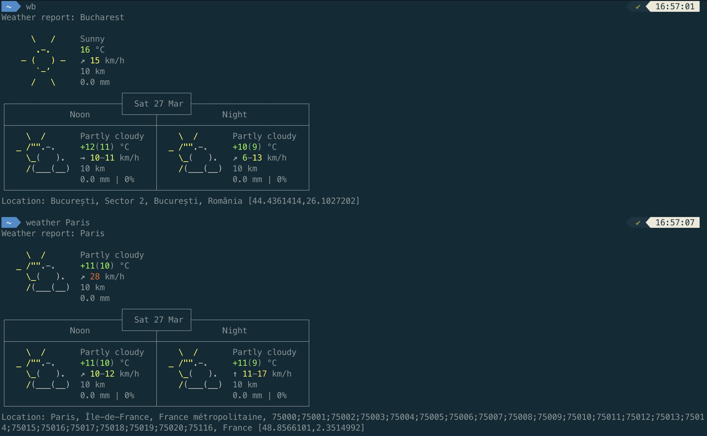

# Bring weather report into your terminal
### available on Linux and MacOS platforms


### **Prerequisites:** 
Python v3, Git

### **Installation:**
1. Clone the project in the home directory
```html
  cd ~/
  git clone https://github.com/razvanvancea/linux-cli-weather-script.git
```
2. Open the .bashrc file
```html
nano ~/.bashrc
```
3. Add the following aliases (in the following script, feel free to replace 'Bucharest' with a different city)
```html
alias wb='python3 ~/linux-cli-weather-script/get_weather.py Bucharest'
alias weather='python3 ~/linux-cli-weather-script/get_weather.py' 
```
4. Save and close the file (e.g. for nano editor: CTRL+X, then press Y and Enter)
5. Use the following command to reload the .bashrc file
```html
source ~/.bashrc
```

### **How to use the scripts?**

Return the weather of **the chosen city** (you chose it in the 'wb' alias step - .bashrc file) via CLI:
```html
wb
```

Return **specific location** weather via CLI (the location name needs to be _passed as argument_):
```html
weather Berlin
```
